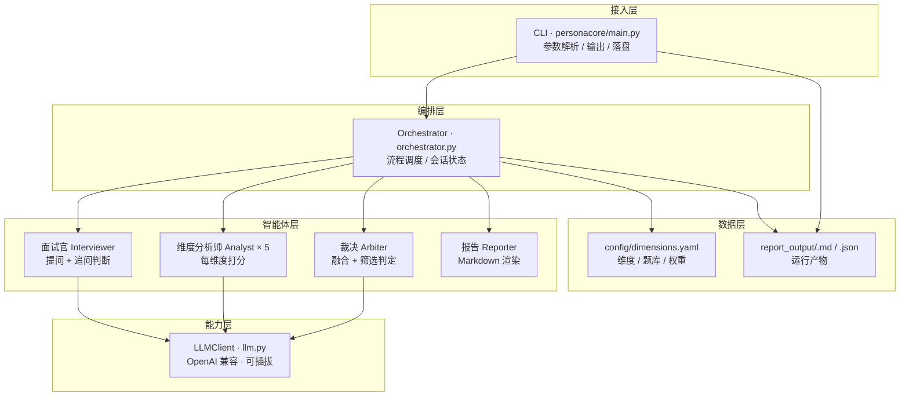
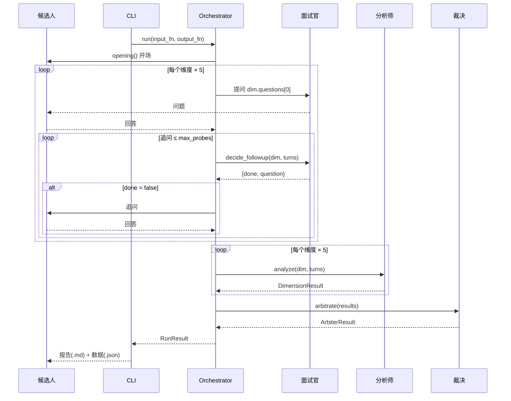
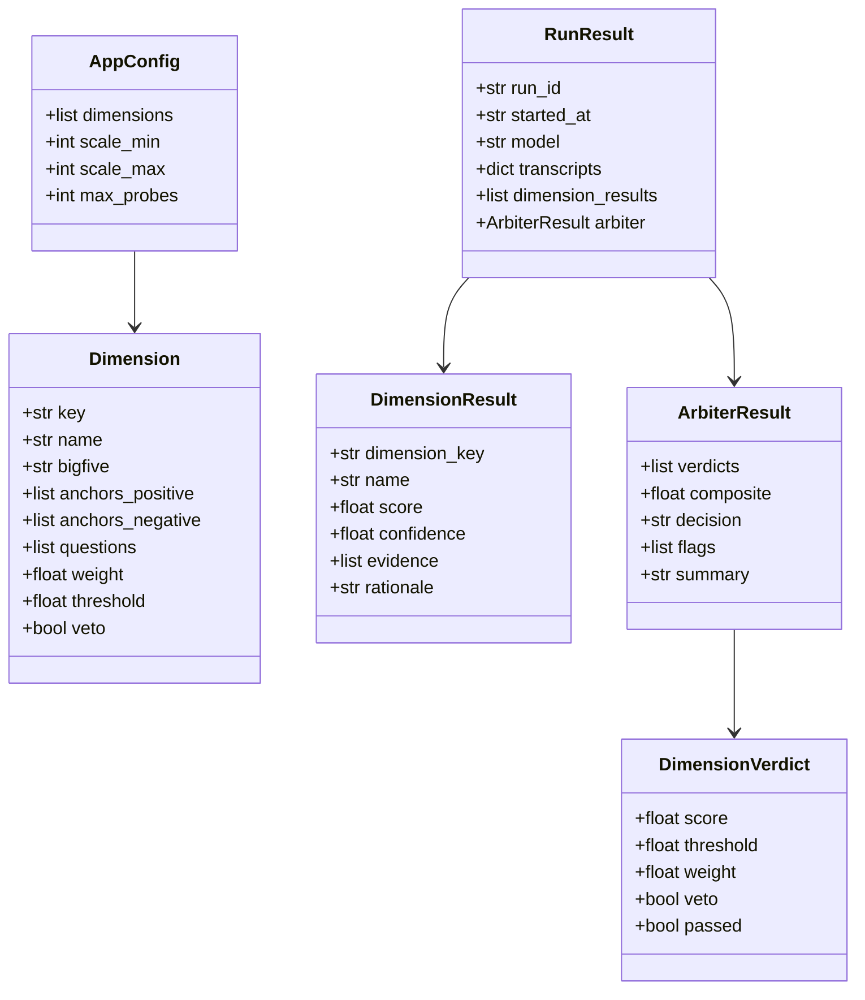

# PersonaCore 架构文档

> 版本：v0.1（MVP，文字对话阶段）　|　更新：2026-08-14
> 本文档描述当前已实现的多智能体文字面试性格测评系统（大五人格 OCEAN）。

---

## 1. 系统概述

### 1.1 定位
PersonaCore 是一个**多模态、多智能体**的面试性格测评系统。当前 MVP 只实现第一模态（**文字对话**），核心链路为：

> **文字面试 → 大五人格评分 → 筛选结论 → 报告**

最终目标：扩展到音频、视频模态，对候选人在**责任心、团队性、抗压、正向情绪**等维度上做量化打分，用于**筛选目标人群**。

### 1.2 MVP 范围（已实现）
- ✅ 结构化文字面试（自适应追问）
- ✅ 大五人格（OCEAN）五个维度打分
- ✅ 证据落地（每个分数引用原文）
- ✅ 综合分 + 通过/待定/淘汰判定
- ✅ 每次运行独立报告（`.md` + `.json`）
- ⬜ 音频、视频模态（见 [`plan.md`](../plan.md) Phase 2/3）

---

## 2. 总体架构

系统采用**分层 + 多智能体**架构，各层职责单一、可替换。



> 接入层现有两种入口：**CLI**（`main.py`）与 **Web**（`web.py`），二者都驱动同一个 `InterviewEngine` 状态机（`engine.py`），面试核心逻辑无 I/O、可复用。

### 2.1 目录结构

```
PersonaCore/
├─ personacore/
│  ├─ main.py               # CLI 入口
│  ├─ web.py                # FastAPI Web 入口
│  ├─ engine.py             # 面试状态机（CLI/Web 共用，无 I/O）
│  ├─ orchestrator.py       # CLI 编排（驱动 engine）
│  ├─ session.py            # RunResult：运行结果与报告渲染
│  ├─ llm.py                # LLM 客户端（OpenAI 兼容 + JSON 提取）
│  ├─ config.py             # 配置加载（维度/权重/阈值）
│  └─ agents/
│     ├─ interviewer.py     # 面试官 Agent
│     ├─ analyst.py         # 维度分析师 Agent
│     ├─ arbiter.py         # 裁决 Agent
│     ├─ report.py          # 报告 Agent
│     └─ _util.py           # 共享工具
├─ web/index.html           # Web 前端（聊天界面）
├─ deploy/                  # systemd / nginx / deploy.sh
├─ config/dimensions.yaml   # 大五维度、锚点、题库、权重
├─ tests/test_smoke.py      # CLI 端到端冒烟测试（假 LLM）
├─ tests/test_web.py        # Web 冒烟测试
├─ docs/architecture.md     # 本文档
└─ plan.md                  # 分阶段实施计划
```

---

## 3. 多智能体设计

### 3.1 Agent 清单

| Agent | 文件 | 职责 | LLM 调用 | 输出 |
|-------|------|------|---------|------|
| 面试官 | `interviewer.py` | 提问 + 判断证据是否充分并追问 | `chat_json` | `{"done": bool, "question": str}` |
| 维度分析师 | `analyst.py` | 单维度打分 + 引用原文证据 | `chat_json` | `DimensionResult` |
| 裁决 | `arbiter.py` | 融合各维度、算综合分、判定结论 | `chat`（仅总结） | `ArbiterResult` |
| 报告 | `report.py` | 渲染 Markdown 报告 | 无 | `str` |

### 3.2 面试官 Agent（Interviewer）

**职责**：主持结构化面试，对候选人的回答做「证据充分性」判断。

- 每个维度先问题库里的主问题（`dim.questions[0]`）。
- 候选人回答后，调用 LLM 判断：证据是否满足 STAR（情境/任务/行动/结果）。
  - 证据充分 → 返回 `DONE`，进入下一维度。
  - 证据不足 → 返回一句追问，最多追问 `max_probes` 次。

**输出结构**（JSON，避免自由文本解析脆弱）：

```json
{"done": false, "question": "能具体讲一个项目吗？当时你是怎么排优先级的？"}
```

### 3.3 维度分析师 Agent（Analyst）

**职责**：每个大五维度一个实例，基于该维度的面试记录打分。

- 输入：该维度 Q&A 全文 + 维度行为锚点（正/负）。
- 输出：`{"score", "confidence", "evidence", "rationale"}`。

**硬约束**：只能依据回答原文打分（grounded），证据不足必须降低 `confidence`。

```json
{
  "score": 3.5,
  "confidence": 0.8,
  "evidence": ["我负责三个项目，用清单排优先级并全部按时交付。"],
  "rationale": "有具体行动和结果，符合正向锚点。"
}
```

### 3.4 裁决 Agent（Arbiter）

**职责**：融合五个维度结果，计算综合分，判定筛选结论，做一致性校验。

**设计要点**：加权计算与判定规则用**确定性代码**实现（不用 LLM 做数学），LLM 只负责生成定性的「总体评价」。

- 综合分：`composite = Σ(维度分 × 权重) / Σ权重`
- 判定规则：

| 条件 | 结论 |
|------|------|
| 触发一票否决（veto 维度未达标） | 淘汰 |
| `composite ≥ 平均合格线` 且所有维度达标 | 通过 |
| 其他 | 待定 |

- 提示（flags）：未达标维度 / 一票否决 / 低置信度（<0.5）。

### 3.5 协作模式

当前为**编排式（Orchestration）**：`Orchestrator` 作为主控，按固定流程串行调用各 Agent。结构简单、可控，适合 MVP。

```
Orchestrator
   │ 1. 面试
   ├─→ Interviewer（×5 维度，循环追问）
   │ 2. 分析（并行可优化）
   ├─→ Analyst × 5
   │ 3. 融合
   └─→ Arbiter ──→ Reporter
```

后续（Phase 4）可升级为**辩论/共识式**：多个分析师对冲突证据多轮辩论后收敛。

---

## 4. 核心流程（运行时序）



---

## 5. 数据模型



### 5.1 落盘产物

每次运行生成两份文件（`report_output/<run_id>.*`）：

| 文件 | 内容 |
|------|------|
| `<run_id>.md` | 元信息 + 面试全记录 + 综合结论 + 各维度得分 + 证据 + 总体评价 |
| `<run_id>.json` | 结构化数据（transcript、各维度分数/证据、composite、decision、flags） |

---

## 6. 配置系统

配置文件 `config/dimensions.yaml` 驱动整个测评，**管理员可改**：

```yaml
dimensions:
  - key: conscientiousness
    name: 尽责性
    bigfive: C
    anchors: { positive: [...], negative: [...] }
    questions: [主问题1, 主问题2]
    # 可选：weight / threshold / veto（覆盖 defaults）
defaults:
  scale_min: 1
  scale_max: 5
  weight: 0.2        # 默认权重
  threshold: 3.0     # 默认合格线
  veto: false        # 是否一票否决
  max_probes: 2      # 每维度最大追问次数
```

**可配置项**：维度权重、合格线、一票否决、行为锚点、题库、追问次数——对应「各维度企业要求由管理员设定」的需求。

---

## 7. LLM 抽象层

- **OpenAI 兼容接口**：通过 `OPENAI_BASE_URL` / `OPENAI_API_KEY` / `LLM_MODEL` 指向任意服务（OpenAI / DeepSeek / 通义 / 智谱）。
- **可插拔**：后续可加其他 Provider，Agent 层不感知具体实现。
- **稳健 JSON 提取**（`llm.extract_json`）：先尝试 `json.loads`，再剥代码块、截取首尾 `{}`/`[]`，兼容各模型输出差异。
- **密钥安全**：`.env` 被 gitignore，不进入版本库。

---

## 8. 可观测性

- 每次运行生成唯一 `run_id`（时间戳到毫秒），报告**互不覆盖**。
- `.md` 给人读（含完整面试记录），`.json` 给程序读（入库/批量分析）。
- 冒烟测试 `tests/test_smoke.py` 用假 LLM 跑通闭环，无需密钥即可回归。

---

## 9. 关键设计决策与权衡

| 决策 | 理由 | 权衡 |
|------|------|------|
| 结构化 JSON 输出 | 避免自由文本解析脆弱（追问曾泄露思考过程） | 依赖模型遵循 JSON 指令 |
| 加权/判定用确定性代码 | 数学不该交给 LLM | 判定规则目前是简化版，需产品化 |
| 单分析师/维度（非多轮辩论） | MVP 简单可控 | 后续可升级共识式提升鲁棒性 |
| 证据必须引用原文 | 防幻觉、防「说得漂亮=高分」 | 对模型能力要求高 |
| OpenAI 兼容层 | 多供应商可切换、零锁定 | 各家 JSON 模式能力有差异 |

---

## 10. 扩展规划

| 阶段 | 内容 | 对架构的影响 |
|------|------|-------------|
| Phase 2 | 音频（ASR + 副语言情绪） | 新增转写 Agent、语音信号 Agent，裁决层做双模态融合 |
| Phase 3 | 视频（表情/微表情） | 新增表情信号 Agent，多模态时间对齐 |
| Phase 4 | 筛选产品化 + 反作弊 | 反作弊 Agent、人在环复核、公平性测试、Web 接入 |

详见 [`plan.md`](../plan.md)。
