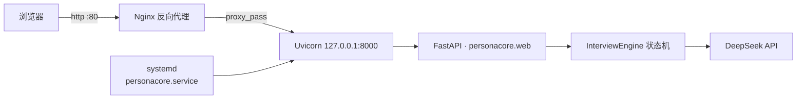

# PersonaCore 部署记录

> 部署日期：2026-08-17
> ⚠️ 本文档含服务器 IP 等部署信息；如需推送到公开仓库，请按需脱敏。密码、密钥一律用占位符，绝不记录明文。

## 1. 部署概览

| 项 | 值 |
|----|----|
| 服务器 | 阿里云 ECS |
| 操作系统 | Ubuntu 24.04 64 位 |
| 公网 IP | `<公网IP>` |
| 登录方式 | root + 密码认证 |
| 部署目录 | `/opt/personacore` |
| 代码仓库 | https://github.com/China-sty/PersonaCore.git |
| 代码版本 | main（commit 74c01fb，Web 化版本） |
| LLM | DeepSeek（`deepseek-chat`） |

## 2. 部署架构



- Nginx 对外监听 80 端口，反向代理到 uvicorn。
- systemd 托管 uvicorn 进程，开机自启 + 异常自动重启。

## 3. 服务器目录结构

```
/opt/personacore/
├─ .env                 # 密钥配置（chmod 600，不入 git）
├─ .venv/               # Python 虚拟环境（uvicorn/fastapi 等）
├─ personacore/         # 应用代码
├─ web/                 # 前端
├─ config/              # 维度配置
├─ deploy/              # 部署脚本 / systemd / nginx 配置
└─ report_output/       # （CLI 模式）报告产物
```

## 4. 部署步骤（已执行）

1. 安装系统依赖
   ```bash
   apt-get update -y
   apt-get install -y git python3 python3-venv python3-pip nginx
   ```
2. 拉取代码
   ```bash
   git clone https://github.com/China-sty/PersonaCore.git /opt/personacore
   ```
3. 写入 `.env`（DeepSeek 密钥）并 `chmod 600 .env`
4. 运行部署脚本
   ```bash
   cd /opt/personacore && bash deploy/deploy.sh
   ```
   `deploy.sh` 完成：建 venv → 装依赖 → 写 systemd unit → 配 nginx → 启动服务

## 5. 关键配置

### 5.1 `.env`（脱敏示例）

```
OPENAI_API_KEY=sk-xxx          # DeepSeek 密钥，明文不记录
OPENAI_BASE_URL=https://api.deepseek.com/v1
LLM_MODEL=deepseek-chat
MAX_PROBES=2
```

### 5.2 systemd（`/etc/systemd/system/personacore.service`）

```ini
[Unit]
Description=PersonaCore interview web service
After=network.target

[Service]
WorkingDirectory=/opt/personacore
ExecStart=/opt/personacore/.venv/bin/uvicorn personacore.web:app --host 127.0.0.1 --port 8000
Restart=always
RestartSec=3

[Install]
WantedBy=multi-user.target
```

### 5.3 nginx（`/etc/nginx/sites-enabled/personacore`）

```nginx
server {
    listen 80;
    server_name _;
    location / {
        proxy_pass http://127.0.0.1:8000;
        proxy_http_version 1.1;
        proxy_set_header Host $host;
        proxy_set_header X-Real-IP $remote_addr;
        proxy_set_header Upgrade $http_upgrade;
        proxy_set_header Connection "upgrade";
        proxy_read_timeout 300s;   # 报告生成较久
    }
}
```

## 6. 验证结果

| 检查项 | 结果 |
|--------|------|
| `systemctl is-active personacore` | ✅ active |
| 开机自启 `is-enabled` | ✅ enabled |
| uvicorn `:8000` | ✅ HTTP 200 |
| nginx `:80` | ✅ HTTP 200 |
| 面试接口 `start` + `message` | ✅ DeepSeek 正常返回追问 |

## 7. 日常运维

```bash
systemctl status personacore          # 查看状态
journalctl -u personacore -f          # 实时日志
systemctl restart personacore         # 重启

# 更新代码后：
cd /opt/personacore && git pull && systemctl restart personacore

# 修改 .env 后：
systemctl restart personacore
```

## 8. 已知限制

- 会话存内存：重启进程会清空进行中的面试会话（MVP 阶段）。
- 报告生成（多智能体分析）约需数十秒，nginx 已放宽超时到 300s。
- 暂无 HTTPS；绑域名需 ICP 备案。

## 9. 安全清单

- [ ] `.env` 权限 600，不入 git
- [ ] root 密码部署后已轮换
- [ ] 安全组仅放行 80（SSH 建议仅限可信来源 IP）
- [ ] 后续加 HTTPS
